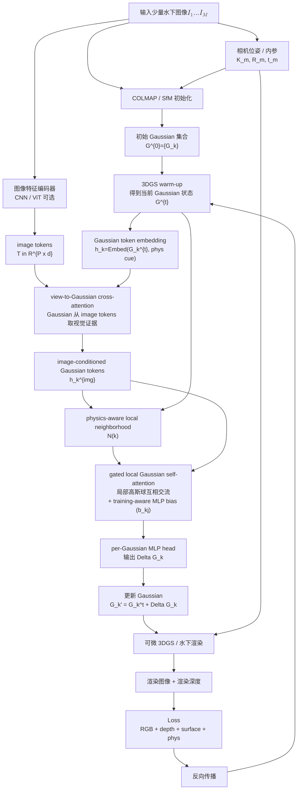
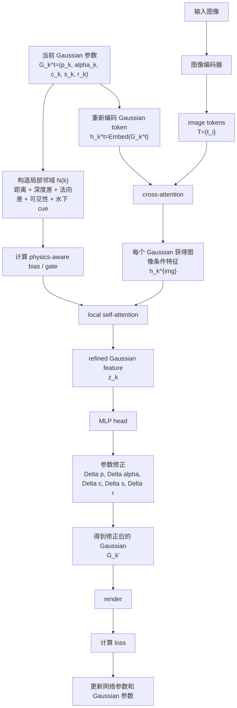

# 方法流程图

核心定位：

```text
不是：
普通 3DGS 训练完成 -> 再后处理修正

而是：
3DGS warm-up / 当前 Gaussian 状态
-> Gaussian token refinement
-> render
-> RGB + 几何/物理 loss
-> 反向传播联合优化
```

## 总流程



## 单次训练迭代内部



## 关键张量形状

| 模块 | 输入 | 输出 | 说明 |
|---|---|---|---|
| 图像编码器 | M 张图像 | T in R^{P x d} | P 是所有图像 patch/token 总数，d 是特征维度 |
| Gaussian embedding | N 个当前 Gaussian | H in R^{N x d} | N 是当前高斯球数量，可以随 densification/pruning 变化 |
| cross-attention | Q=H, K=T, V=T | H_img in R^{N x d} | 每个 Gaussian 从图像 token 里取相关视觉信息 |
| local neighborhood | 当前 Gaussian 集合 | N(k) | 每个 Gaussian 找 K 个局部邻居，K 固定或用 mask |
| local self-attention | H_img 和邻域 N(k) | Z in R^{N x d} | 只做局部 attention，避免全局 O(N^2) |
| MLP head | Z in R^{N x d} | Delta G in R^{N x D_out} | 每个 Gaussian 输出自己的参数修正 |
| 渲染器 | 修正后 Gaussian + 相机 | RGB / depth | 用可微渲染结果计算 loss |

## 为什么高斯球数量变化不会炸

```text
网络不绑定固定高斯球个数 N。

每个 Gaussian 都用同一个 Embed / MLP 处理。
N 变大：多几行 token。
N 变小：少几行 token。
特征维度 d 不变，所以网络参数不需要改。
```

更准确地说：

$$
H \in \mathbb R^{N \times d}
$$

其中：

```text
N：当前高斯球数量，可以变
d：token 特征维度，固定
```

新增 Gaussian：

```text
G_new -> Embed(G_new) -> h_new
```

删除 Gaussian：

```text
直接删除对应 token 行
```

## 关键公式

图像 tokens：

$$
T = \mathrm{Enc}(I_1,\ldots,I_M)
$$

Gaussian token：

$$
h_k^{t}
=
\mathrm{Embed}
(
p_k^t,\alpha_k^t,c_k^t,s_k^t,r_k^t,e_k^{phys}
)
$$

从图像中取信息：

$$
\tilde h_k^{t}
=
\mathrm{CrossAttn}
(
Q=h_k^t,
K=T,
V=T
)
$$

局部表面 attention（带 training-aware bias）：

$$
z_k^t
=
\mathrm{LocalSelfAttn}
(
\tilde h_k^t,
\{\tilde h_j^t:j\in\mathcal N(k)\};
b_{kj}
)
$$

其中 attention 权重为：

$$
\mathrm{Attn}_{kj}
=
\mathrm{softmax}_j
\!\left(
\frac{q_k^{T} k_j}{\sqrt{d}}
+
\gamma\cdot b_{kj}
\right)
$$

bias 由一个小 MLP 对每对 (k,j) 单独打分得到（per-pair scoring）：

$$
b_{kj}
=
\mathrm{MLP}_{bias}
\big(
[\,
\|\nabla_{p_j}\mathcal L\|,\;
\alpha_j,\;
\mathrm{age}_j,\;
\mathrm{aniso}_j,\;
\Delta d_{kj},\;
n_k\!\cdot\! n_j,\;
\mathrm{covis}_{kj},\;
\Delta\beta_{kj}
\,]
\big)
$$

输入特征语义：

```text
||∇p_j L||      ：高斯 j 的位置梯度，指示该区域是否欠拟合
α_j             ：高斯 j 的不透明度，反映自身可信度
age_j           ：自上次 split/clone 起的步数，刚生成的高斯不稳定
aniso_j         ：1 - min(s_j)/max(s_j)，各向异性强度，决定法向是否可信
Δd_kj           ：相机坐标系下的深度差，跨表面的邻居要压
n_k · n_j       ：法向夹角余弦（最短轴近似），同向表面优先
covis_kj        ：共可见相机集合的 IoU，被同一批相机看到的更相关
Δβ_kj           ：水下散射差（可选），衰减条件相似的更可比
```

设计要点：

```text
1. MLP 输入是「3DGS 训练动态量 + 高斯自身状态 + 几何 + 物理」
   的组合，区别于已有 Gaussian attention（仅用相对位置/距离）。
2. MLP 是 per-pair 跑：每对 (k, j) 各自得一个标量 bias，
   拼起来形状 [N, K]，与 q^T k 矩阵逐元素相加。
3. γ 为可学习强度标量，初始化为 0：
   - 训练初期 bias 不起作用，attention 走纯数据驱动；
   - 真正有信号时网络自动把 γ 学大；
   - 默认无害，最坏情况退化为普通 attention。
4. warm-up 阶段（前若干步）建议关掉 bias，等高斯位置/α 稳定
   后再开，避免被未收敛的训练动态量误导。
```

可选：用 sigmoid gate 替代 logits bias（更鲁棒，不会扭曲 q·k 相对结构）：

$$
g_{kj}=\sigma(\gamma\cdot b_{kj}),\quad
z_k=\sum_j g_{kj}\cdot\mathrm{Attn}_{kj}\cdot v_j
$$

输出修正量：

$$
\Delta G_k^t
=
\mathrm{MLP}_{head}(z_k^t)
$$

更新 Gaussian：

$$
G_k'
=
G_k^t+\Delta G_k^t
$$

训练目标：

$$
\mathcal L
=
\mathcal L_{rgb}
+
\lambda_d\mathcal L_{depth}
+
\lambda_s\mathcal L_{surface}
+
\lambda_p\mathcal L_{phys}
$$

## 大白话版

```text
1. 先用 COLMAP / 3DGS 得到一批当前高斯球。
2. 每一轮训练时，把每个高斯球的位置、颜色、透明度、尺度等编码成 token。
3. 图片经过 CNN/ViT 得到 image tokens。
4. 每个高斯球 token 去 image tokens 里面找和自己相关的视觉证据。
5. 再给每个高斯球找局部邻居，而且不是只看距离，还看深度、法向、可见性、水下散射等。
6. 局部邻居之间做 attention，靠谱邻居多听，不靠谱邻居少听。
7. MLP 输出每个高斯球的参数修正量。
8. 修正后的高斯球再去渲染，和真实图片算 loss。
9. loss 反向传播，更新网络和高斯球。
```

## 论文图里要避免的错误画法

| 错误画法 | 为什么不对 | 正确画法 |
|---|---|---|
| ViT 直接输出 N 个 Gaussian 特征 | ViT 输出的是 image tokens，不知道当前有多少高斯球 | Gaussian token 作为 query，从 image tokens 里 cross-attention 取信息 |
| 所有高斯球全局 self-attention | 高斯球数量大，O(N^2) 太贵 | 每个高斯球只和 K 个局部邻居做 local attention |
| 3DGS 训练完成后再修正 | 如果同一个 loss 已经最优，后处理修正逻辑不成立 | 在训练循环中联合优化 |
| 固定高斯球数量 N | 3DGS 会 densification / pruning，N 会变 | 网络只固定特征维度 d，不固定 N |
| 只写加 attention | 太泛，容易被质疑没有创新 | 写成 physics-aware local Gaussian attention |
