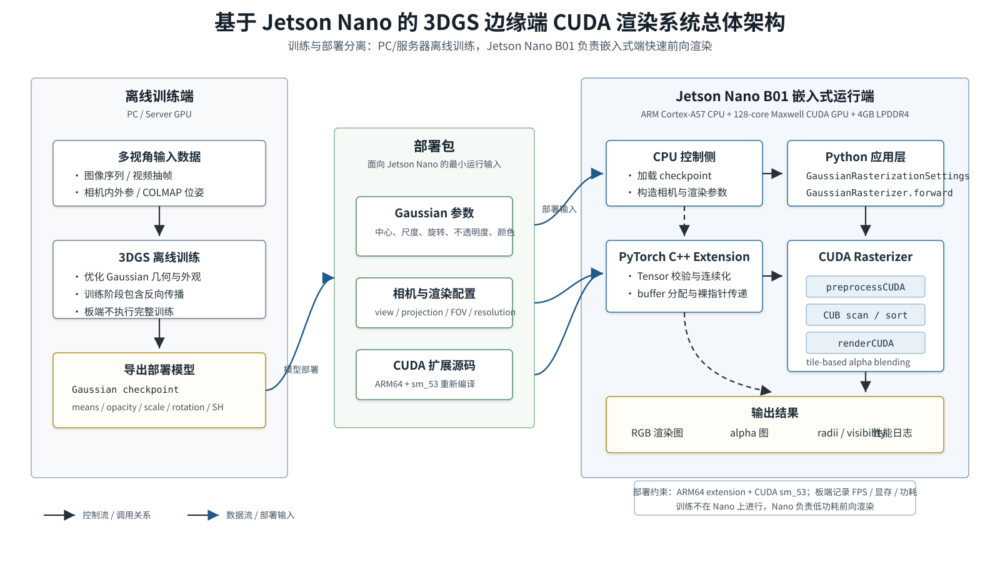
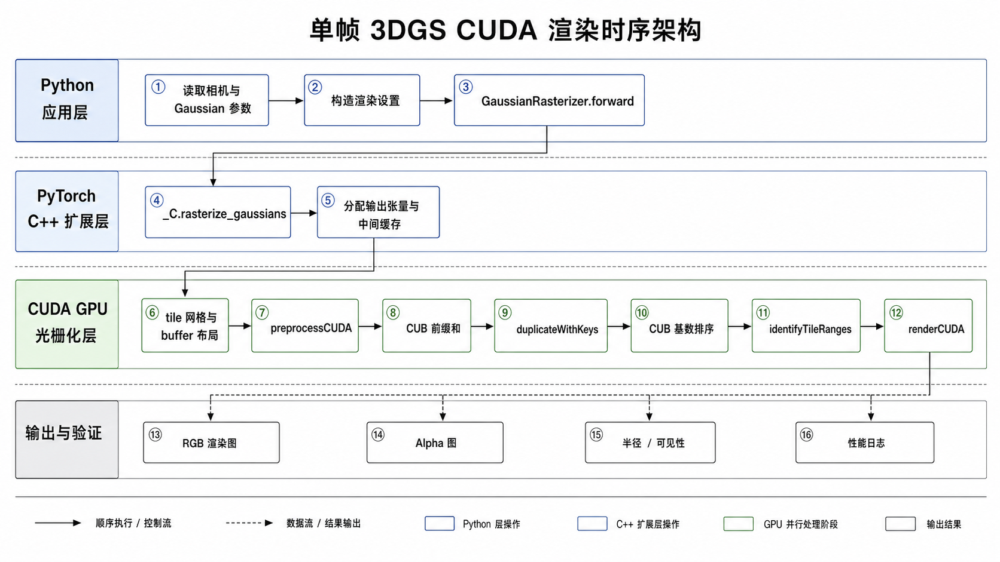
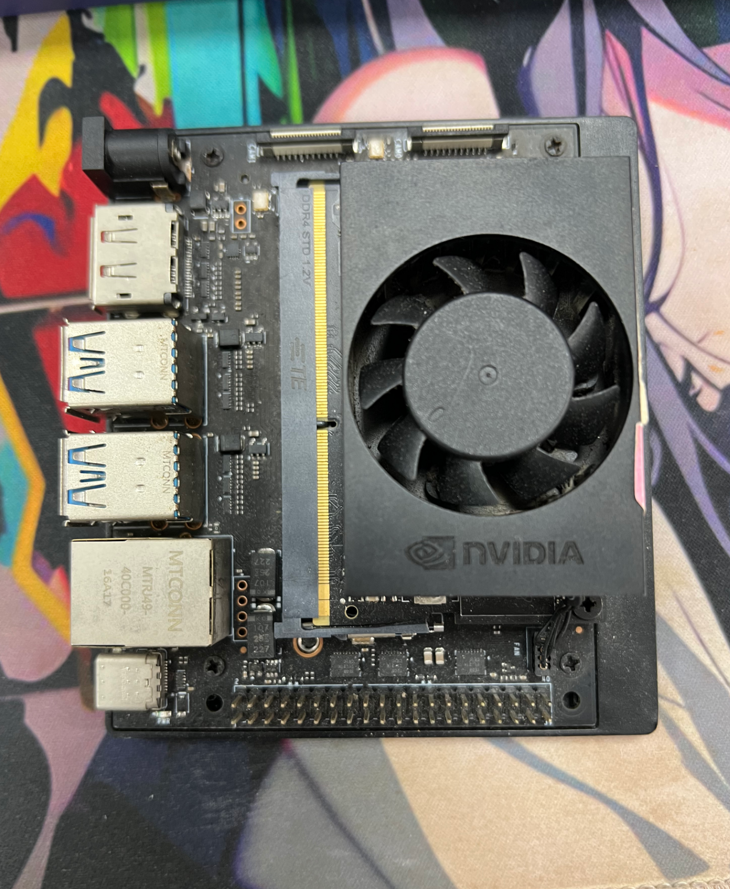
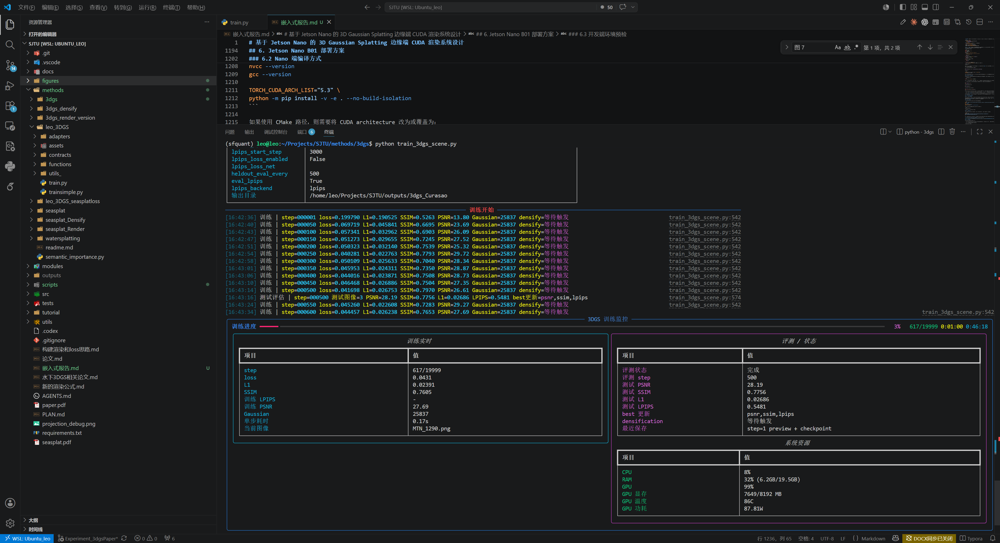
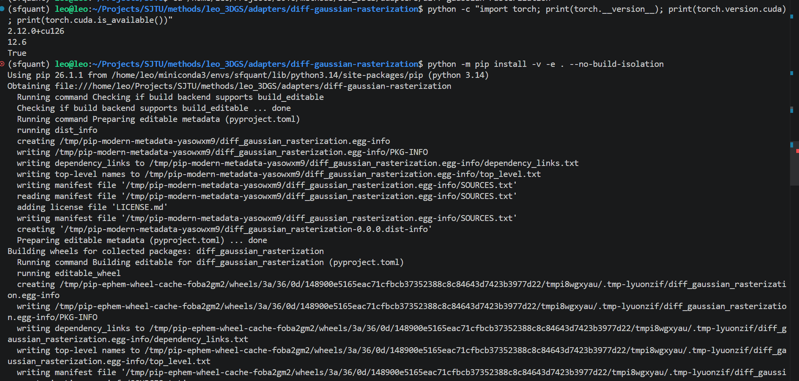
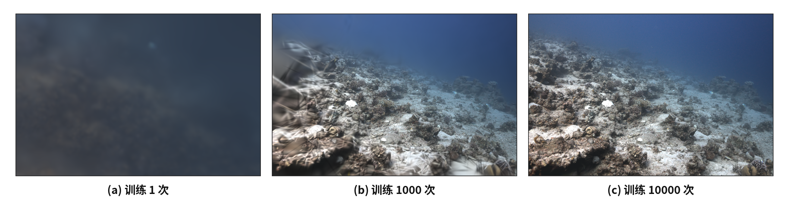

# 基于 Jetson Nano 的 3D Gaussian Splatting 边缘端 CUDA 渲染系统设计

## 摘要

本报告设计一个面向边缘端三维场景可视化的嵌入式系统：在 Jetson Nano B01 开发板上部署 3D Gaussian Splatting（3DGS）渲染模块，使训练好的 Gaussian 场景模型能够在嵌入式 GPU 上完成快速视角渲染。系统的核心任务不是在板端重新训练 3DGS，而是将 PC 或服务器上训练完成的 Gaussian 参数、相机参数和背景颜色输入 Jetson Nano，由 CUDA rasterizer 完成几何投影、屏幕分块、深度排序和 alpha 合成，最终输出 RGB 图像、alpha 图和可见性半径。

本设计重点实现和适配的是 3DGS 的 CUDA 差分光栅化渲染模块。该模块通过 PyTorch C++ extension 暴露给 Python 应用层，内部使用 CUDA kernel 对大量 Gaussian 进行并行预处理和 tile-based rasterization。报告将从嵌入式系统设计流程出发，说明该系统“要解决什么问题、用什么硬件、软件如何分层、CUDA 底层并行计算如何服务于 3DGS 快速渲染”，并结合训练过程、编译验证和渲染结果图说明系统设计的完整性。

## 1. 设计背景与需求分析

### 1.1 应用背景

3DGS 是一种面向新视角合成的三维场景表示方法。它用大量带有位置、尺度、旋转、不透明度和颜色信息的三维 Gaussian 表示场景，相比传统 NeRF 中密集 MLP 采样的方式，3DGS 避免了大量空空间计算，更适合实时渲染。原论文强调 3DGS 通过各向异性 Gaussian 表示、密度控制和快速可见性感知渲染，在高质量新视角合成中取得实时渲染能力。

在嵌入式应用中，三维场景渲染常常需要在算力、功耗和体积受限的平台上运行。例如：

- 机器人巡检：机器人在移动过程中需要快速查看已重建环境的当前视角。
- 水下巡检：水下设备采集图像后，可以在边缘端进行三维场景预览，辅助操作员判断结构位置。
- 移动端 3D 重建预览：采集端不一定有桌面级 GPU，但仍需要快速渲染当前 3DGS 模型。
- 数字孪生边缘展示：在低功耗设备上展示局部三维场景，降低对远程服务器和网络带宽的依赖。

因此，本系统选择 Jetson Nano B01 作为嵌入式板端平台，将训练阶段和部署渲染阶段拆开：训练可以在 PC 或服务器完成，Jetson Nano 负责加载训练后的 Gaussian 参数并执行 CUDA 快速渲染。

### 1.2 系统目标

本系统要完成的核心目标如下：

1. 在 Jetson Nano B01 上部署 3DGS 渲染模块。
2. 输入训练好的 Gaussian 场景参数和相机参数。
3. 使用 CUDA 在 GPU 上执行快速 rasterization。
4. 输出当前视角的 RGB 渲染图、alpha 图和每个 Gaussian 的屏幕半径。
5. 保持 Python 调用接口简单，隐藏 CUDA 内部实现细节。
6. 给出编译验证、功能验证和渲染结果分析，形成完整的课程设计闭环。

### 1.3 输入与输出

系统输入保持为窄接口，不把复杂的训练状态或内部缓存直接暴露给上层。

输入数据包括：

- Gaussian 几何参数：`means3D`、`scales`、`rotations`。
- Gaussian 外观参数：`sh` 或 `colors_precomp`。
- Gaussian 不透明度：`opacities`。
- 相机参数：`viewmatrix`、`projmatrix`、`tanfovx`、`tanfovy`、`campos`。
- 图像参数：`image_height`、`image_width`。
- 背景颜色：`bg`。

输出数据包括：

- `render`：当前视角 RGB 渲染结果，shape 为 `[3, H, W]`。
- `alpha`：当前视角 alpha 图，shape 为 `[1, H, W]`。
- `radii`：每个 Gaussian 在屏幕空间中的影响半径，shape 为 `[N]`。
- `visibility_filter`：由 `radii > 0` 得到的可见 Gaussian 掩码。

### 1.4 约束条件

Jetson Nano B01 是低功耗嵌入式平台，设计时需要考虑以下约束：

- GPU 核心数量有限，需要避免把逐像素、逐 Gaussian 的全量组合暴力展开。
- 4GB LPDDR4 内存容量有限，需要控制中间 buffer 和图像分辨率。
- 板端功耗通常在 5W 到 10W 档位内，不能采用桌面 GPU 上不计代价的计算方案。
- Jetson Nano 的 compute capability 为 5.3，CUDA 扩展必须针对 `sm_53` 重新编译。
- PC 端编译得到的扩展二进制通常面向 `x86_64` 平台，不能直接复制到 Jetson Nano 的 ARM64 系统上使用。

### 1.5 功能需求与非功能需求

从嵌入式系统设计角度看，本系统不仅要“能渲染”，还要在输入、输出、性能、可部署性和可验证性上形成完整闭环。功能需求定义系统必须提供什么能力，非功能需求定义这些能力在嵌入式板端应该满足什么约束。

| 需求类别 | 需求内容 | 设计响应 |
| --- | --- | --- |
| 模型加载 | 能加载训练完成的 Gaussian 参数 | 训练端导出 checkpoint，板端只执行加载和渲染 |
| 相机视角渲染 | 能根据相机外参、内参生成当前视角图像 | Python 层构造 `viewmatrix`、`projmatrix`、`tanfovx`、`tanfovy` |
| GPU 加速 | 大量 Gaussian 投影和像素合成必须在 GPU 上执行 | 使用 `preprocessCUDA`、CUB scan/sort 和 `renderCUDA` |
| 输出结果 | 输出 RGB 图、alpha 图和可见性信息 | 输出 `out_color`、`out_alpha`、`radii` |
| 可部署性 | 能在 Jetson Nano B01 上独立运行 | ARM64 环境重新编译 PyTorch CUDA extension |
| 可验证性 | 能用明确命令验证扩展加载和单帧渲染 | 提供 import smoke test、shape 检查和渲染结果图 |
| 资源受限 | 需要考虑 4GB 内存和低功耗模式 | 使用 tile-based 工作集和中间 buffer 动态分配 |

这里特别强调“板端快速渲染”而不是“板端完整训练”。3DGS 训练阶段涉及反向传播、优化器状态和 densification，显存与计算负担明显高于单纯渲染；而课程设计的嵌入式应用重点是把一个已经训练好的三维表示部署到低功耗边缘设备上，验证 CUDA 并行渲染模块如何支撑实时或准实时显示。

### 1.6 系统边界

本系统的边界可以分为包含内容和不包含内容两部分。

包含内容：

- Jetson Nano B01 上的 3DGS 渲染部署方案。
- `diff-gaussian-rasterization` CUDA rasterizer 的接口设计和并行计算流程。
- Gaussian 参数到 RGB 图像的前向渲染流程。
- 编译、部署、单帧功能验证和渲染结果分析。

不包含内容：

- 不在 Jetson Nano 上完成完整 3DGS 训练。
- 不在本报告中填写未经实测的 FPS、功耗或显存占用。
- 不把 CUDA 内部临时 buffer 作为公开接口交给上层应用。
- 不讨论复杂 UI、网络服务或远程可视化平台，只保留必要的嵌入式渲染核心。

这种边界划分可以避免系统目标发散。也就是说，本设计的关键问题不是“如何做一个通用三维可视化软件”，而是“如何把 3DGS 的核心 rasterization 放到 Jetson Nano 这类嵌入式 CUDA 平台上，并解释它为什么这样并行化”。

### 1.7 应用场景建模与任务闭环

从应用形态上看，本系统更接近“边缘端三维场景预览模块”，而不是完整三维重建工作站。它面向的典型流程是：前端设备采集图像，离线或半离线完成 3DGS 训练，训练结果被下发到嵌入式板端，板端根据当前视角快速渲染局部场景，再把图像结果反馈给操作者或上层控制系统。这个闭环可以写成：

```text
图像采集
  -> 位姿估计与离线训练
  -> Gaussian 场景参数部署
  -> Jetson Nano 端 CUDA 渲染
  -> RGB/alpha/可见性结果输出
  -> 操作员观察或机器人决策辅助
```

在机器人巡检场景中，机器人可以先通过相机采集厂房、管廊或设备表面的图像数据，训练端得到三维 Gaussian 场景后部署到板端。机器人运行时不需要重新训练模型，只需要根据当前位置和朝向生成相机矩阵，在 Jetson Nano 上渲染对应视角。这样可以在低功耗设备上提供近似实时的三维场景预览，辅助判断障碍物、结构位置和巡检目标。

在水下巡检场景中，水下设备受到通信带宽、供电和算力限制，不能总是把全部视觉数据实时传回高性能工作站。3DGS 模型可以作为一种压缩后的三维场景表示，板端只加载 Gaussian 参数和当前相机视角，输出当前观察方向的渲染图。虽然水下图像会受到散射、低照度和颜色偏移影响，但从系统设计角度看，CUDA rasterizer 的职责仍然清晰：它不负责图像增强或训练优化，而负责把已经得到的三维表示快速投影成二维图像。

在移动端 3D 重建预览中，用户更关注“当前模型是否已经重建出可用结构”。这类需求不一定要求板端达到桌面 GPU 的最高画质，而要求系统能在有限功耗内稳定给出反馈。因此，本设计把目标定义为单帧或连续多帧的快速渲染验证，并通过 `radii` 和 alpha 图提供可见性信息，便于判断当前视角下 Gaussian 是否正常覆盖图像区域。

### 1.8 与传统方案的对比

如果只考虑最终输出，CPU 朴素光栅化、NeRF 推理渲染和 3DGS CUDA rasterizer 都可以生成二维视角图像。但从嵌入式系统设计角度看，它们对计算资源的要求和可部署性差异明显。

| 方案 | 主要计算方式 | 嵌入式部署难点 | 与本系统的关系 |
| --- | --- | --- | --- |
| CPU 朴素投影与逐像素合成 | 对像素和 Gaussian 做大量循环遍历 | 复杂度高，难以利用 GPU 并行，CPU 占用大 | 可作为正确性参考，不适合作为板端主路径 |
| NeRF 推理渲染 | 沿每条 camera ray 多点采样并查询 MLP | 采样次数多，网络推理密集，低功耗板端压力大 | 质量高但板端实时预览难度更高 |
| 3DGS CUDA rasterizer | Gaussian 投影、tile binning、排序和 alpha 合成 | 需要 CUDA extension 与 GPU 架构匹配 | 本系统采用的核心方案 |

CPU 朴素实现的直观复杂度可以近似写为：

$$
O(HWN)
$$

其中 \(H\) 和 \(W\) 是图像高宽，\(N\) 是 Gaussian 数量。这个复杂度意味着每个像素都可能访问全部 Gaussian，在板端 CPU 上很难承受。3DGS CUDA rasterizer 则先估计每个 Gaussian 的屏幕影响范围，只把它展开到实际覆盖的 tile 中。若第 \(i\) 个 Gaussian 覆盖的 tile 数为 \(t_i\)，则 binning 阶段处理的展开实例数为：

$$
N_{\mathrm{tile}} = \sum_{i=1}^{N} t_i
$$

之后每个像素只遍历本 tile 的局部 Gaussian 列表，而不是遍历全局 \(N\) 个 Gaussian。这个设计不保证在所有场景中都达到固定倍数加速，但它把计算组织方式从“全局暴力枚举”变成了“局部可见工作集”，更符合 GPU 和嵌入式低功耗平台的计算特点。

## 2. 嵌入式系统总体设计

### 2.1 设计流程

按照嵌入式系统常见设计流程，本系统分为以下阶段：

1. 需求分析：明确目标是板端快速 3DGS 渲染，而不是板端完整训练。
2. 硬件选型：选择 Jetson Nano B01，利用其 CUDA GPU 执行并行渲染。
3. 软件架构设计：划分 Python 应用层、C++ extension 适配层、CUDA rasterizer 核心层。
4. CUDA 并行算法设计：将 Gaussian 预处理、tile binning、tile 内 alpha blending 映射到 GPU 线程模型。
5. 编译与部署：在 Jetson Nano 上按 ARM64 和 `sm_53` 重新编译扩展。
6. 测试验证：验证 import、单帧渲染、输出 shape、可见性和渲染结果图。

### 2.2 系统数据流

系统主流程如下：

```text
训练完成的 3DGS 模型
  -> Gaussian 参数导出或加载
  -> Python 应用层构造相机和 raster settings
  -> PyTorch C++ extension 接收 CUDA Tensor
  -> CUDA rasterizer 进行并行投影、分块、排序、合成
  -> 输出 RGB 图像、alpha 图、radii
  -> 保存图像或送入上层显示模块
```

在这个流程中，Jetson Nano 只负责推理渲染。训练过程可由 PC 或服务器端的 3DGS 训练程序完成，训练得到的 Gaussian checkpoint 再部署到板端。这样可以避免在 Jetson Nano 上执行长时间反向传播和 densification，符合嵌入式设备的算力和功耗定位。



图 1 展示了本系统的总体架构。左侧为离线训练端，负责由多视角图像和相机参数训练得到 Gaussian checkpoint；中间为部署包，包含 Gaussian 参数、相机配置和 CUDA rasterizer 源码；右侧为 Jetson Nano B01 嵌入式运行端，CPU 负责加载模型和调度，Python 应用层通过 PyTorch C++ extension 调用 CUDA rasterizer，GPU 侧完成 `preprocessCUDA`、CUB scan/sort 和 `renderCUDA`，最终输出 RGB 渲染图、alpha 图、可见性信息和性能日志。

### 2.3 软硬件协同设计

嵌入式系统设计的关键不是单独写软件或单独选硬件，而是让任务负载和硬件结构匹配。3DGS 渲染中最重的计算包括大量 Gaussian 的投影、协方差变换、tile 覆盖计算和像素级 alpha blending。这些任务有明显的数据并行性，因此放在 Jetson Nano 的 CUDA GPU 上更合适。

CPU 侧主要承担以下任务：

- 读取 checkpoint、相机文件和配置参数。
- 构造 `GaussianRasterizationSettings`。
- 调用 PyTorch extension，发起 CUDA kernel。
- 保存输出图像或把结果传给显示模块。

GPU 侧主要承担以下任务：

- 对所有 Gaussian 并行执行投影和屏幕半径估计。
- 对 tile 覆盖关系进行 prefix sum 和 radix sort。
- 在每个 tile 内并行完成像素颜色合成。
- 输出连续内存布局的 RGB 图像和 alpha 图。

这种协同方式避免了 CPU 做大量重复浮点计算，也避免了在 Python 层逐点、逐像素循环。Python 只负责组织数据和调度，CUDA 负责高吞吐量计算。这正是嵌入式异构计算中常见的设计思路：CPU 控制流程，GPU 处理数据并行核心。

### 2.4 单帧渲染时序

一次单帧渲染不是单个函数内部完成的，而是跨越 Python 应用层、C++ extension 边界、CUDA GPU 计算层和输出验证层。图 2 用泳道式结构表示这一过程：Python 侧读取相机和 Gaussian 参数并构造渲染设置；C++ extension 侧负责输出 Tensor 和中间 buffer 分配；CUDA 侧依次完成 tile grid 初始化、Gaussian 预处理、CUB prefix sum、tile-depth key 排序、tile range 生成和最终像素级 alpha blending；最后渲染结果回到 Python 侧保存或显示。



图 2 中 T5 到 T11 是核心 GPU 计算阶段。它们的共同特点是输入输出明确，并且每个阶段只处理自己负责的数据结构。这样的设计有利于调试：如果渲染图为空，可以先看 `radii` 是否全为 0；如果 `radii` 正常但图像异常，可以检查 tile sorting 和 alpha blending；如果扩展无法加载，则优先检查编译架构和 PyTorch/CUDA ABI。

## 3. 硬件方案设计

### 3.1 核心计算平台

本系统选择 Jetson Nano B01 作为嵌入式计算平台。根据 NVIDIA 官方资料，Jetson Nano 采用 Maxwell 架构 GPU，包含 128 个 NVIDIA CUDA cores；CPU 为 Quad-core ARM Cortex-A57；内存为 4GB 64-bit LPDDR4，带宽为 25.6GB/s。NVIDIA legacy CUDA GPU compute capability 表中列出 Jetson Nano 的 compute capability 为 5.3。

这些硬件特性决定了本设计的几个原则：

- 需要充分利用 CUDA GPU 的 SIMT 并行能力，把大量 Gaussian 和像素计算放到 GPU 上。
- 需要减少 CPU-GPU 之间的频繁数据传输，尽量让中间 buffer 保持在 CUDA Tensor 中。
- 需要控制图像分辨率、Gaussian 数量和中间 buffer 大小，避免超过 4GB 内存限制。
- 编译时必须生成 `sm_53` 目标代码，否则在 Nano 上可能无法加载或性能不正确。

### 3.2 外设与系统组成

系统硬件可由以下部分组成：

| 模块 | 作用 |
| --- | --- |
| Jetson Nano B01 | 嵌入式主控和 CUDA 渲染计算核心 |
| microSD 或 eMMC 存储 | 保存系统镜像、Python 环境、模型文件、渲染输出 |
| 显示器或远程终端 | 查看渲染结果和调试信息 |
| 网络接口 | 从 PC 传输模型文件或进行远程控制 |
| 电源与散热 | 保证 5W/10W 模式下稳定运行 |

### 3.3 PC 端与板端分工

本设计采用“PC 训练 + Jetson 渲染”的分工方式：

- PC/服务器端：负责 COLMAP 数据准备、3DGS 训练、checkpoint 保存、必要的离线质量评估。
- Jetson Nano 端：负责加载训练后的 Gaussian 参数，构造相机视角，调用 CUDA rasterizer 输出图像。

这样设计的原因是，3DGS 训练需要反复前向渲染、反向传播、densification 和优化器更新，对显存和算力要求更高；而嵌入式端更适合作为低功耗部署设备，执行固定模型的快速渲染。



图 3 展示了实拍 Jetson Nano B01 目标部署硬件，用于说明 CUDA rasterizer 需要在 ARM64 与 Jetson CUDA 环境下完成编译、加载和渲染验证。



图 4 展示了 3DGS 离线训练过程，用于说明 Gaussian 场景参数来自 PC 或服务器端训练阶段。Jetson Nano 端部署时加载的是训练完成后的 Gaussian 参数，因此板端主要承担 CUDA 渲染推理，而不执行完整训练流程。

### 3.4 资源预算与硬件约束分析

Jetson Nano B01 的 4GB 内存需要同时容纳系统、Python 运行时、PyTorch、模型参数、中间 buffer 和输出图像。因此，设计时不能只考虑算法复杂度，也要估计内存压力。设场景中有 \(N\) 个 Gaussian，图像大小为 \(H\times W\)，RGB 通道数为 3，则输出图像本身占用大约：

$$
3HW \cdot 4\ \mathrm{bytes}
$$

alpha 图占用大约：

$$
HW \cdot 4\ \mathrm{bytes}
$$

每个 Gaussian 至少保存位置、尺度、旋转、不透明度、SH 或颜色等参数。虽然单个参数张量不大，但当 \(N\) 达到几十万时，总内存会明显增加。除此之外，CUDA rasterizer 会使用 `GeometryState`、`BinningState` 和 `ImageState` 这样的中间状态。特别是 `BinningState` 的大小和展开后的 Gaussian-tile 实例数 `num_rendered` 有关。如果某些 Gaussian 屏幕半径过大，它会覆盖很多 tile，导致 binning buffer 增大。

因此，板端部署时需要重点控制以下变量：

- 图像分辨率：分辨率越高，tile 数量和输出图像内存越大。
- Gaussian 数量：数量越多，预处理和排序压力越大。
- Gaussian 屏幕半径：半径越大，单个 Gaussian 覆盖的 tile 越多。
- SH 阶数：SH 阶数越高，颜色参数越多，颜色计算也更重。
- batch 策略：本系统以单帧渲染为主，不把多视角一次性 batch 到板端。

从硬件约束看，Jetson Nano 的优势是具备 CUDA 编程能力，适合实现底层并行渲染；不足是 GPU 核心数量、显存容量和功耗余量都有限。因此，本设计采用 tile-based rasterization 而不是全局逐像素遍历所有 Gaussian，这一点是嵌入式可运行性的关键。

## 4. 软件方案设计

### 4.1 软件分层

本系统的软件结构分为三层：

```text
Python 应用层
  -> PyTorch C++ extension 适配层
  -> CUDA rasterizer 核心层
```

第一层是 Python 应用层，负责加载模型、读取相机参数、创建 `GaussianRasterizationSettings`，并调用 `GaussianRasterizer`。

第二层是 PyTorch C++ extension 适配层，负责将 Python 中的 Tensor 参数转换为 C++/CUDA 可访问的连续内存指针，并把 CUDA kernel 的输出重新包装为 PyTorch Tensor。

第三层是 CUDA rasterizer 核心层，负责真正的 GPU 并行计算，包括 Gaussian 预处理、tile 分配、排序和像素合成。

### 4.2 Python 应用层接口

Python 应用层不是直接操作 CUDA kernel，而是先把一次渲染需要的相机参数、图像参数和背景颜色封装到 `GaussianRasterizationSettings` 中。关键代码如下：

```python
class GaussianRasterizationSettings(NamedTuple):
    image_height: int
    image_width: int
    tanfovx: float
    tanfovy: float
    bg: torch.Tensor
    scale_modifier: float
    viewmatrix: torch.Tensor
    projmatrix: torch.Tensor
    sh_degree: int
    campos: torch.Tensor
    prefiltered: bool
    debug: bool
```

这个结构只保存当前视角渲染所必需的数据：图像高宽、视场角、背景颜色、相机矩阵、SH 阶数、相机中心和调试开关。它没有把训练器、数据集对象、优化器或 CUDA 内部 buffer 传入 rasterizer，因此上层接口比较窄。

真正发起渲染的是 `GaussianRasterizer.forward`。它先检查输入是否合法，再调用 `rasterize_gaussians` 进入 C++/CUDA extension：

```python
class GaussianRasterizer(nn.Module):
    def __init__(self, raster_settings):
        super().__init__()
        self.raster_settings = raster_settings

    def forward(
        self,
        means3D,
        means2D,
        opacities,
        shs=None,
        colors_precomp=None,
        scales=None,
        rotations=None,
        cov3D_precomp=None,
    ):
        raster_settings = self.raster_settings

        if (shs is None and colors_precomp is None) or (
            shs is not None and colors_precomp is not None
        ):
            raise Exception(
                "Please provide excatly one of either SHs or precomputed colors!"
            )

        if ((scales is None or rotations is None) and cov3D_precomp is None) or (
            (scales is not None or rotations is not None)
            and cov3D_precomp is not None
        ):
            raise Exception(
                "Please provide exactly one of either scale/rotation pair "
                "or precomputed 3D covariance!"
            )

        if shs is None:
            shs = torch.Tensor([])
        if colors_precomp is None:
            colors_precomp = torch.Tensor([])
        if scales is None:
            scales = torch.Tensor([])
        if rotations is None:
            rotations = torch.Tensor([])
        if cov3D_precomp is None:
            cov3D_precomp = torch.Tensor([])

        return rasterize_gaussians(
            means3D,
            means2D,
            shs,
            colors_precomp,
            opacities,
            scales,
            rotations,
            cov3D_precomp,
            raster_settings,
        )
```

这段代码体现了两个设计点。第一，颜色来源必须二选一：要么传入 SH 系数 `shs`，要么传入已经计算好的 `colors_precomp`，避免 CUDA 层出现两套颜色来源。第二，协方差来源也必须二选一：要么由 `scales` 和 `rotations` 在 CUDA 中计算三维协方差，要么直接传入 `cov3D_precomp`。这样上层不会把互相冲突的输入传给底层。

### 4.3 C++ extension 适配层

Python 调用 `_C.rasterize_gaussians` 时，首先进入 pybind 暴露的 C++ 接口。绑定代码如下：

```cpp
PYBIND11_MODULE(TORCH_EXTENSION_NAME, m) {
  m.def("rasterize_gaussians", &RasterizeGaussiansCUDA);
  m.def("rasterize_gaussians_backward", &RasterizeGaussiansBackwardCUDA);
  m.def("mark_visible", &markVisible);
}
```

其中本系统板端推理渲染主要使用 `RasterizeGaussiansCUDA`。该函数负责创建输出 Tensor、创建中间 buffer，并把 PyTorch Tensor 的连续内存指针传给 CUDA rasterizer：

```cpp
std::tuple<int, torch::Tensor, torch::Tensor, torch::Tensor,
           torch::Tensor, torch::Tensor, torch::Tensor>
RasterizeGaussiansCUDA(
    const torch::Tensor& background,
    const torch::Tensor& means3D,
    const torch::Tensor& colors,
    const torch::Tensor& opacity,
    const torch::Tensor& scales,
    const torch::Tensor& rotations,
    const float scale_modifier,
    const torch::Tensor& cov3D_precomp,
    const torch::Tensor& viewmatrix,
    const torch::Tensor& projmatrix,
    const float tan_fovx,
    const float tan_fovy,
    const int image_height,
    const int image_width,
    const torch::Tensor& sh,
    const int degree,
    const torch::Tensor& campos,
    const bool prefiltered,
    const bool debug)
{
  const int P = means3D.size(0);
  const int H = image_height;
  const int W = image_width;

  auto float_opts = means3D.options().dtype(torch::kFloat32);

  torch::Tensor out_color = torch::full({NUM_CHANNELS, H, W}, 0.0, float_opts);
  torch::Tensor out_alpha = torch::full({1, H, W}, 0.0, float_opts);
  torch::Tensor radii = torch::full(
      {P}, 0, means3D.options().dtype(torch::kInt32));

  torch::Device device(torch::kCUDA);
  torch::TensorOptions options(torch::kByte);
  torch::Tensor geomBuffer = torch::empty({0}, options.device(device));
  torch::Tensor binningBuffer = torch::empty({0}, options.device(device));
  torch::Tensor imgBuffer = torch::empty({0}, options.device(device));

  std::function<char*(size_t)> geomFunc = resizeFunctional(geomBuffer);
  std::function<char*(size_t)> binningFunc = resizeFunctional(binningBuffer);
  std::function<char*(size_t)> imgFunc = resizeFunctional(imgBuffer);

  int rendered = 0;
  if (P != 0) {
    int M = 0;
    if (sh.size(0) != 0) {
      M = sh.size(1);
    }

    rendered = CudaRasterizer::Rasterizer::forward(
        geomFunc,
        binningFunc,
        imgFunc,
        P, degree, M,
        background.contiguous().data<float>(),
        W, H,
        means3D.contiguous().data<float>(),
        sh.contiguous().data_ptr<float>(),
        colors.contiguous().data<float>(),
        opacity.contiguous().data<float>(),
        scales.contiguous().data_ptr<float>(),
        scale_modifier,
        rotations.contiguous().data_ptr<float>(),
        cov3D_precomp.contiguous().data<float>(),
        viewmatrix.contiguous().data<float>(),
        projmatrix.contiguous().data<float>(),
        campos.contiguous().data<float>(),
        tan_fovx,
        tan_fovy,
        prefiltered,
        out_color.contiguous().data<float>(),
        out_alpha.contiguous().data<float>(),
        radii.contiguous().data<int>(),
        debug);
  }

  return std::make_tuple(
      rendered, out_color, out_alpha, radii,
      geomBuffer, binningBuffer, imgBuffer);
}
```

这段 C++ 代码是 Python 和 CUDA 的边界。Python 层传入的是 `torch.Tensor`，CUDA 层需要的是裸指针，例如 `means3D.contiguous().data<float>()`。因此这里统一做两件事：第一，分配输出图像、alpha 和半径；第二，把所有输入输出 Tensor 转成 CUDA kernel 可访问的连续内存地址。

### 4.4 CUDA rasterizer 核心层

进入 `CudaRasterizer::Rasterizer::forward` 后，系统开始执行真正的 CUDA 渲染主流程。关键代码如下：

```cpp
int CudaRasterizer::Rasterizer::forward(
    std::function<char* (size_t)> geometryBuffer,
    std::function<char* (size_t)> binningBuffer,
    std::function<char* (size_t)> imageBuffer,
    const int P, int D, int M,
    const float* background,
    const int width, int height,
    const float* means3D,
    const float* shs,
    const float* colors_precomp,
    const float* opacities,
    const float* scales,
    const float scale_modifier,
    const float* rotations,
    const float* cov3D_precomp,
    const float* viewmatrix,
    const float* projmatrix,
    const float* cam_pos,
    const float tan_fovx, float tan_fovy,
    const bool prefiltered,
    float* out_color,
    float* out_alpha,
    int* radii,
    bool debug)
{
    const float focal_y = height / (2.0f * tan_fovy);
    const float focal_x = width / (2.0f * tan_fovx);

    size_t chunk_size = required<GeometryState>(P);
    char* chunkptr = geometryBuffer(chunk_size);
    GeometryState geomState = GeometryState::fromChunk(chunkptr, P);

    if (radii == nullptr)
    {
        radii = geomState.internal_radii;
    }

    dim3 tile_grid(
        (width + BLOCK_X - 1) / BLOCK_X,
        (height + BLOCK_Y - 1) / BLOCK_Y,
        1);
    dim3 block(BLOCK_X, BLOCK_Y, 1);

    size_t img_chunk_size = required<ImageState>(width * height);
    char* img_chunkptr = imageBuffer(img_chunk_size);
    ImageState imgState = ImageState::fromChunk(
        img_chunkptr,
        width * height);

    CHECK_CUDA(FORWARD::preprocess(
        P, D, M,
        means3D,
        (glm::vec3*)scales,
        scale_modifier,
        (glm::vec4*)rotations,
        opacities,
        shs,
        geomState.clamped,
        cov3D_precomp,
        colors_precomp,
        viewmatrix, projmatrix,
        (glm::vec3*)cam_pos,
        width, height,
        focal_x, focal_y,
        tan_fovx, tan_fovy,
        radii,
        geomState.means2D,
        geomState.depths,
        geomState.cov3D,
        geomState.rgb,
        geomState.conic_opacity,
        tile_grid,
        geomState.tiles_touched,
        prefiltered), debug)

    CHECK_CUDA(cub::DeviceScan::InclusiveSum(
        geomState.scanning_space,
        geomState.scan_size,
        geomState.tiles_touched,
        geomState.point_offsets,
        P), debug)

    int num_rendered;
    CHECK_CUDA(cudaMemcpy(
        &num_rendered,
        geomState.point_offsets + P - 1,
        sizeof(int),
        cudaMemcpyDeviceToHost), debug);

    size_t binning_chunk_size = required<BinningState>(num_rendered);
    char* binning_chunkptr = binningBuffer(binning_chunk_size);
    BinningState binningState = BinningState::fromChunk(
        binning_chunkptr,
        num_rendered);

    duplicateWithKeys<<<(P + 255) / 256, 256>>>(
        P,
        geomState.means2D,
        geomState.depths,
        geomState.point_offsets,
        binningState.point_list_keys_unsorted,
        binningState.point_list_unsorted,
        radii,
        tile_grid);

    int bit = getHigherMsb(tile_grid.x * tile_grid.y);

    CHECK_CUDA(cub::DeviceRadixSort::SortPairs(
        binningState.list_sorting_space,
        binningState.sorting_size,
        binningState.point_list_keys_unsorted,
        binningState.point_list_keys,
        binningState.point_list_unsorted,
        binningState.point_list,
        num_rendered, 0, 32 + bit), debug)

    CHECK_CUDA(cudaMemset(
        imgState.ranges,
        0,
        tile_grid.x * tile_grid.y * sizeof(uint2)), debug);

    if (num_rendered > 0) {
        identifyTileRanges<<<(num_rendered + 255) / 256, 256>>>(
            num_rendered,
            binningState.point_list_keys,
            imgState.ranges);
    }

    const float* feature_ptr =
        colors_precomp != nullptr ? colors_precomp : geomState.rgb;

    CHECK_CUDA(FORWARD::render(
        tile_grid, block,
        imgState.ranges,
        binningState.point_list,
        width, height,
        geomState.means2D,
        feature_ptr,
        geomState.conic_opacity,
        out_alpha,
        imgState.n_contrib,
        background,
        out_color), debug)

    return num_rendered;
}
```

这段代码就是整个 CUDA 渲染器的主干。它先根据图像宽高建立 tile 网格，再调用 `FORWARD::preprocess` 对每个 Gaussian 做投影和屏幕范围估计；然后用 `cub::DeviceScan::InclusiveSum` 计算每个 Gaussian 展开到 tile 列表中的写入偏移；接着通过 `duplicateWithKeys` 生成 `[tile_id | depth]` 形式的排序 key；再用 `cub::DeviceRadixSort::SortPairs` 按 tile 和深度排序；最后 `identifyTileRanges` 为每个 tile 找到自己的 Gaussian 区间，`FORWARD::render` 执行 tile 内 alpha 合成。

因此，软件设计不是简单调用一个库函数，而是把 3DGS 渲染拆成了“预处理、分块、排序、合成”四个明确阶段。每个阶段都有固定输入和输出，中间状态只在 CUDA rasterizer 内部流动，不泄漏给 Python 应用层。

### 4.5 数据接口契约与 Tensor 形状约束

为了让 Python 应用层、C++ extension 和 CUDA kernel 之间保持稳定边界，系统需要明确每个 Tensor 的含义、形状和所属层次。这里的“接口契约”不是新增代码接口，而是对已有调用关系的整理。上层只需要知道哪些输入必须提供、输出张量代表什么；至于 `GeometryState`、`BinningState`、`ImageState` 等中间状态，则仍由 CUDA rasterizer 内部管理。

| 名称 | 典型形状 | 所属层次 | 含义 |
| --- | --- | --- | --- |
| `means3D` | `[N, 3]` | Python 输入 / CUDA 读取 | 每个 Gaussian 的三维中心坐标 |
| `means2D` | `[N, 2]` 或辅助 Tensor | Python 输入 / autograd 辅助变量 | 屏幕空间中心相关的梯度承载变量 |
| `opacities` | `[N, 1]` 或 `[N]` | Python 输入 / CUDA 读取 | 每个 Gaussian 的不透明度 |
| `scales` | `[N, 3]` | Python 输入 / CUDA 读取 | 三个方向上的尺度参数 |
| `rotations` | `[N, 4]` | Python 输入 / CUDA 读取 | 用四元数表示的旋转参数 |
| `cov3D_precomp` | `[N, 6]` 或空 Tensor | 可选输入 | 预计算三维协方差，只保存对称矩阵上三角元素 |
| `sh` | `[N, M, 3]` 或空 Tensor | 可选输入 | 球谐颜色系数 |
| `colors_precomp` | `[N, 3]` 或空 Tensor | 可选输入 | 预计算 RGB 颜色 |
| `viewmatrix` | `[4, 4]` | 相机输入 | 世界坐标到相机坐标的变换 |
| `projmatrix` | `[4, 4]` | 相机输入 | 相机坐标到裁剪空间的投影变换 |
| `out_color` | `[3, H, W]` | CUDA 输出 / Python 返回 | 当前视角 RGB 渲染图 |
| `out_alpha` | `[1, H, W]` | CUDA 输出 / Python 返回 | 当前视角 alpha 累积图 |
| `radii` | `[N]` | CUDA 输出 / Python 返回 | 每个 Gaussian 的屏幕空间半径 |

该契约体现了嵌入式软件设计中的窄接口原则。Python 层只传递必要的模型参数、相机参数和图像设置，不把训练器内部对象、数据集对象或渲染器临时状态传入底层。C++ extension 只负责张量边界转换和 buffer 分配，不承担相机逻辑或应用逻辑。CUDA 层只处理连续内存指针和数值计算，不反向依赖 Python 对象。

这种分层方式也便于板端定位问题。如果 `out_color` 的 shape 不符合预期，优先检查 C++ extension 的输出分配；如果 `radii` 全为 0，优先检查相机矩阵、视锥剔除和 Gaussian 坐标尺度；如果 `out_alpha` 正常但颜色异常，则重点检查 SH 颜色计算或 `colors_precomp` 输入。每个问题都能被映射到明确层次，而不是在 Python、C++ 和 CUDA 之间混杂排查。

## 5. CUDA 底层计算原理与渲染算法设计

### 5.1 为什么 3DGS 渲染适合 CUDA

3DGS 渲染的计算模式具有明显的数据并行特征：

- 每个 Gaussian 的投影、协方差变换、屏幕半径估计基本可以独立计算。
- 屏幕被划分为多个 tile 后，每个 tile 可以独立处理自己的 Gaussian 列表。
- tile 内每个像素的 alpha blending 可以由一个线程负责。
- 大量计算是浮点矩阵运算、指数运算和局部循环，适合 GPU 的 SIMT 执行模型。

如果在 CPU 上朴素实现，可能需要对每个像素遍历所有 Gaussian，复杂度接近 \(O(HWN)\)，其中 \(H\) 和 \(W\) 是图像高宽，\(N\) 是 Gaussian 数量。CUDA 版本通过视锥剔除、屏幕半径估计、tile binning 和深度排序，把每个像素只需要处理的 Gaussian 限制在与该 tile 有交集的局部列表中，从而减少无效计算。

### 5.2 Gaussian 几何表示

每个 3D Gaussian 的核心几何参数包括中心 \(\mu_i\)、尺度 \(s_i\) 和旋转 \(R_i\)。尺度矩阵记为：

$$
S_i =
\begin{bmatrix}
s_{ix} & 0 & 0 \\
0 & s_{iy} & 0 \\
0 & 0 & s_{iz}
\end{bmatrix}
$$

如果 \(R_i\) 由四元数转换得到，则世界坐标系下的三维协方差可以写为：

$$
\Sigma_{3D,i}
=
(S_iR_i)^\top(S_iR_i)
$$

代码中 `computeCov3D` 正是根据 scale 和 rotation 构造该协方差矩阵，并且由于协方差矩阵对称，只保存 6 个上三角元素：

$$
(\Sigma_{00}, \Sigma_{01}, \Sigma_{02}, \Sigma_{11}, \Sigma_{12}, \Sigma_{22})
$$

这样做可以减少显存占用和访存量，适合 Jetson Nano 这种内存带宽有限的平台。

### 5.3 从三维 Gaussian 到屏幕二维 Gaussian

渲染时需要把三维 Gaussian 投影到图像平面。设 \(W\) 表示 view matrix 中的旋转部分，\(J\) 表示透视投影对三维点的局部雅可比矩阵，则屏幕空间二维协方差可表示为：

$$
\Sigma_{2D,i}
=
T^\top \Sigma_{3D,i} T,
\quad
T = WJ
$$

在代码中，`computeCov2D` 使用焦距、视场角、view matrix 和三维协方差计算屏幕空间协方差。随后对二维协方差求逆，得到 conic 矩阵参数：

$$
Q_i =
\Sigma_{2D,i}^{-1}
=
\begin{bmatrix}
a_i & b_i \\
b_i & c_i
\end{bmatrix}
$$

代码中将 \(a_i\)、\(b_i\)、\(c_i\) 和 opacity 打包为 `float4 conic_opacity`：

$$
\mathrm{conic\_opacity}_i = (a_i, b_i, c_i, o_i)
$$

这样在 `renderCUDA` 中，每个像素只需要一次连续读取即可得到 Gaussian 的二维形状和不透明度，减少全局内存访存次数。

### 5.4 `preprocessCUDA`：每个 Gaussian 的并行预处理

`preprocessCUDA` 的线程映射方式是“一个 CUDA thread 处理一个 Gaussian”。kernel 中通过：

```text
idx = cg::this_grid().thread_rank()
```

得到当前 Gaussian 索引。对每个 Gaussian，预处理阶段完成以下工作：

1. 初始化 `radii[idx] = 0` 和 `tiles_touched[idx] = 0`，默认不可见。
2. 进行近裁剪和视锥判断，不在视野内的 Gaussian 直接返回。
3. 使用投影矩阵把三维中心投影到 NDC，再换算为像素坐标。
4. 根据 scale 和 rotation 计算三维协方差，或使用预计算协方差。
5. 根据相机参数把三维协方差投影为二维协方差。
6. 对二维协方差求逆，得到 conic 参数。
7. 通过二维协方差特征值估计屏幕半径 \(r_i\)。
8. 计算该 Gaussian 覆盖的 tile 矩形范围。
9. 如果颜色未预计算，则根据 SH 系数和观察方向计算 RGB。
10. 写入 `depths`、`radii`、`points_xy_image`、`conic_opacity` 和 `tiles_touched`。

屏幕半径由二维协方差最大特征值估计。设二维协方差为：

$$
\Sigma_{2D}
=
\begin{bmatrix}
\sigma_{xx} & \sigma_{xy} \\
\sigma_{xy} & \sigma_{yy}
\end{bmatrix}
$$

代码中先计算：

$$
m = \frac{1}{2}(\sigma_{xx}+\sigma_{yy})
$$

再计算特征值：

$$
\lambda_1 =
m + \sqrt{\max(0.1, m^2-\det(\Sigma_{2D}))}
$$

$$
\lambda_2 =
m - \sqrt{\max(0.1, m^2-\det(\Sigma_{2D}))}
$$

屏幕半径近似为：

$$
r_i =
\left\lceil 3\sqrt{\max(\lambda_1,\lambda_2)} \right\rceil
$$

这一步将连续的二维 Gaussian 转换为屏幕上的有限影响区域。只有覆盖当前 tile 的 Gaussian 之后才会参与该 tile 的渲染，因此它是减少无效计算的关键。

### 5.5 tile 划分：让空间局部性匹配 GPU block

当前配置中：

```text
BLOCK_X = 16
BLOCK_Y = 16
BLOCK_SIZE = 256
```

也就是说，一个 tile 覆盖 \(16\times16\) 个像素，一个 CUDA block 包含 256 个线程。`renderCUDA` 中每个 block 负责一个 tile，每个 thread 负责 tile 内一个像素。

这种设计符合 CUDA 的 block/thread 层次：

- grid 维度对应整张图像的 tile 网格。
- block 对应一个 tile。
- thread 对应 tile 内的一个像素。
- shared memory 用来缓存当前 tile 需要处理的一批 Gaussian。

对于宽度为 \(W\)、高度为 \(H\) 的图像，tile 网格大小为：

$$
G_x = \left\lceil \frac{W}{16} \right\rceil
$$

$$
G_y = \left\lceil \frac{H}{16} \right\rceil
$$

每个 tile 只处理覆盖它的 Gaussian，而不是遍历全场景所有 Gaussian。

### 5.6 CUB prefix sum 与 radix sort：构造 tile 工作列表

`preprocessCUDA` 输出 `tiles_touched[i]`，表示第 \(i\) 个 Gaussian 覆盖了多少个 tile。为了给每个 Gaussian 在全局列表中分配写入位置，需要对 `tiles_touched` 做 prefix sum：

$$
\mathrm{offset}_i =
\sum_{k=0}^{i} \mathrm{tiles\_touched}_k
$$

代码中使用：

```text
cub::DeviceScan::InclusiveSum
```

完成这个并行前缀和操作。最后一个 offset 即为展开后的 Gaussian-tile 实例总数 `num_rendered`。

随后 `duplicateWithKeys` 会为每个 Gaussian 覆盖的每个 tile 生成一个 key/value：

```text
key   = [tile_id | depth]
value = gaussian_id
```

其中 key 的高 32 位是 tile ID，低 32 位是 depth 的位级表示。之后使用：

```text
cub::DeviceRadixSort::SortPairs
```

对 key/value 排序。排序后，同一个 tile 的 Gaussian 会连续排列，并且在 tile 内按 depth 顺序排列。这样 `identifyTileRanges` 只需要扫描排序后的 key，就能为每个 tile 得到 `[start, end)` 工作区间。

这一设计把复杂的可见性组织问题转化为 GPU 上高效的 scan 和 radix sort。它比在每个像素中动态搜索所有 Gaussian 更适合 GPU，因为排序后的访问范围连续，tile 内计算也更规整。

### 5.7 `renderCUDA`：tile 内并行 alpha 合成

`renderCUDA` 的核心任务是：每个 block 处理一个 tile，每个 thread 负责一个像素，对该 tile 的 Gaussian 列表执行 front-to-back alpha blending。

对于像素 \(u=(x,y)\)，设 Gaussian 投影中心为 \(\mu_i^{2D}\)，则像素到中心的偏移为：

$$
d_i(u)
=
\begin{bmatrix}
\mu_{ix}^{2D} - x \\
\mu_{iy}^{2D} - y
\end{bmatrix}
$$

Gaussian 在该像素的指数项为：

$$
p_i(u)
=
-\frac{1}{2} d_i(u)^\top Q_i d_i(u)
$$

有效 alpha 为：

$$
\alpha_i(u)
=
\min\left(0.99,\ o_i\exp(p_i(u))\right)
$$

当 \(\alpha_i(u) < \frac{1}{255}\) 时，代码直接跳过该 Gaussian，因为它对最终颜色贡献很小。这样可以减少无意义的累加。

front-to-back 合成中，设第 \(i\) 个 Gaussian 前方的剩余透射率为 \(T_i(u)\)，则：

$$
T_i(u)
=
\prod_{j<i}(1-\alpha_j(u))
$$

当前 Gaussian 的颜色贡献为：

$$
\Delta C_i(u)
=
T_i(u)\alpha_i(u)c_i
$$

最终颜色为：

$$
C(u)
=
\sum_i T_i(u)\alpha_i(u)c_i
+
T_{\mathrm{final}}(u)c_{\mathrm{bg}}
$$

其中：

- \(c_i\)：第 \(i\) 个 Gaussian 的 RGB 颜色，可以由 SH 计算得到，也可以由 `colors_precomp` 提供。
- \(c_{\mathrm{bg}}\)：背景颜色。
- \(T_{\mathrm{final}}(u)\)：所有有效 Gaussian 合成之后剩余的背景透射率。

在代码实现中，每个线程维护自己的 `T` 和 `C[CHANNELS]`。当：

$$
T(1-\alpha_i) < 0.0001
$$

说明该像素已经几乎被前景 Gaussian 遮挡，更远 Gaussian 的贡献很小，线程会设置 `done = true`，提前结束该像素的 rasterization。

### 5.8 shared memory 的使用

`renderCUDA` 并不是让每个线程都独立从 global memory 读取同一批 Gaussian，而是让一个 block 内的线程协同把一批 Gaussian 数据搬到 shared memory：

```text
__shared__ int collected_id[BLOCK_SIZE]
__shared__ float2 collected_xy[BLOCK_SIZE]
__shared__ float4 collected_conic_opacity[BLOCK_SIZE]
```

这一设计利用了 tile 内像素的空间局部性：同一个 tile 的 256 个像素通常会访问同一批 Gaussian。如果每个线程都从 global memory 读取这些 Gaussian，会造成重复访存；而 shared memory 位于 SM 内部，访问延迟更低，适合 block 内线程复用。

在 Jetson Nano 这种内存带宽较有限的平台上，shared memory 复用尤其重要。它可以降低 global memory 压力，让更多时间花在实际浮点计算和 alpha blending 上。

### 5.9 CUDA 并行结构总结

本 CUDA rasterizer 的主要并行结构可以概括为：

| 阶段 | 并行粒度 | 主要工作 | 设计原因 |
| --- | --- | --- | --- |
| `preprocessCUDA` | 一个 thread 对应一个 Gaussian | 投影、协方差、半径、tile 覆盖数 | Gaussian 之间相互独立，适合数据并行 |
| CUB prefix sum | GPU 并行 scan | 计算展开列表 offset | 快速生成连续写入位置 |
| `duplicateWithKeys` | 一个 thread 对应一个 Gaussian | 生成 tile-depth key/value | 将空间覆盖关系转成可排序列表 |
| CUB radix sort | GPU 并行排序 | 按 tile 和 depth 排序 | 保证 tile 内合成顺序正确 |
| `identifyTileRanges` | 一个 thread 对应一个展开实例 | 记录每个 tile 的区间 | 为 render kernel 提供窄工作范围 |
| `renderCUDA` | 一个 block 对应一个 tile，一个 thread 对应一个像素 | shared memory 缓存 + alpha blending | 匹配 GPU block/thread 层次和图像局部性 |

### 5.10 kernel 切分原因

该 CUDA rasterizer 没有把所有逻辑写进一个巨大的 kernel，而是拆成多个阶段。这样做有几个原因。

第一，预处理阶段的并行粒度是 Gaussian。每个 Gaussian 只需要根据自己的位置、尺度、旋转、opacity 和相机参数计算投影结果，天然适合“一个 thread 对应一个 Gaussian”。如果把预处理放进像素渲染 kernel 中，就会导致同一个 Gaussian 被不同 tile 重复计算，浪费算力。

第二，排序阶段需要全局视角。为了让每个 tile 内的 Gaussian 按深度排列，需要先生成全局 key/value 列表，再调用 CUB radix sort。排序不是单个 tile 内局部能完全解决的问题，因为同一个 Gaussian 可能覆盖多个 tile，需要先展开再排序。

第三，合成阶段的并行粒度是像素。当前像素的颜色需要按深度顺序累加多个 Gaussian 的贡献，因此一个线程维护一个像素的 \(T\) 和 \(C\) 最自然。如果让一个 Gaussian 一个线程去写多个像素，就会遇到多个线程同时写同一个像素的问题，需要 atomic 或复杂归约，反而会增加同步开销。

因此，kernel 切分后的计算模型是：

```text
Gaussian 并行预处理
  -> 全局 tile-depth 排序
  -> tile 内像素并行合成
```

这个模型把三种不同并行粒度分开处理，使每个阶段的线程职责更单一，也更容易在 Jetson Nano 这类资源有限的平台上调试和优化。

### 5.11 内存访问设计

CUDA 性能往往不只取决于计算量，也取决于访存方式。该 rasterizer 中的主要访存设计包括以下几点。

第一，输入张量在进入 C++ extension 时统一调用 `contiguous()`，保证传给 CUDA 的指针对应连续内存。这样 kernel 中访问 `means3D`、`opacity`、`scales`、`rotations` 等数组时，地址计算简单，减少因为非连续 Tensor 带来的额外开销。

第二，`GeometryState`、`BinningState` 和 `ImageState` 使用一整块 byte buffer 切分得到，而不是在 CUDA 侧零散申请许多小数组。这样可以减少内存管理复杂度，也方便 PyTorch Tensor 统一持有这些中间缓存。

第三，tile 内合成时使用 shared memory 缓存一批 Gaussian：

```cpp
__shared__ int collected_id[BLOCK_SIZE];
__shared__ float2 collected_xy[BLOCK_SIZE];
__shared__ float4 collected_conic_opacity[BLOCK_SIZE];
```

同一个 tile 内的 256 个像素会反复访问同一批 Gaussian 的中心和 conic 参数。如果每个线程都从 global memory 重复读，带宽压力会很大。shared memory 把这些数据放到 block 内部复用，更符合 CUDA 存储层次。

第四，输出图像采用 channel-first 形式：

```text
out_color[ch * H * W + pix_id]
```

这种布局与 PyTorch 中常见的 `[C, H, W]` 图像张量一致，Python 层拿到结果后可以直接保存或继续参与上层计算。

### 5.12 嵌入式平台上的优化取舍

在桌面 GPU 上，可以通过更大的分辨率、更大的 Gaussian 数量和更高的 SH 阶数追求画质；但在 Jetson Nano 上，渲染设计必须更关注稳定运行。这里的优化取舍主要体现在：

- 优先保证单帧渲染链路稳定，再追求更高 FPS。
- 优先控制分辨率和 Gaussian 数量，而不是盲目增大模型规模。
- 优先使用已有 CUB 高效原语，而不是手写复杂 scan/sort。
- 优先保持接口清晰，避免为局部性能优化暴露过多内部状态。
- 不根据桌面 GPU 的运行表现直接推断 Nano 端表现，重点分析嵌入式部署中的计算和存储约束。

从嵌入式系统角度看，这些取舍比单纯追求理论最高速度更重要。因为板端部署最终要面对的是功耗、散热、内存和环境稳定性，算法必须在这些限制下可运行、可复现、可调试。

### 5.13 `preprocessCUDA` 关键路径分析

`preprocessCUDA` 是渲染流水线的第一段 GPU kernel。它的作用不是直接生成图像，而是把原始 Gaussian 参数转换为 tile-based rasterization 需要的屏幕空间数据。其关键代码路径可以概括为：

```cpp
radii[idx] = 0;
tiles_touched[idx] = 0;

float3 p_view;
if (!in_frustum(idx, orig_points, viewmatrix, projmatrix, prefiltered, p_view))
    return;

float4 p_hom = transformPoint4x4(p_orig, projmatrix);
float p_w = 1.0f / (p_hom.w + 0.0000001f);
float3 p_proj = { p_hom.x * p_w, p_hom.y * p_w, p_hom.z * p_w };

float3 cov = computeCov2D(
    p_orig, focal_x, focal_y,
    tan_fovx, tan_fovy,
    cov3D, viewmatrix);

float det = (cov.x * cov.z - cov.y * cov.y);
if (det == 0.0f)
    return;

float det_inv = 1.f / det;
float3 conic = { cov.z * det_inv, -cov.y * det_inv, cov.x * det_inv };
```

这段路径体现了三个底层设计点。第一，kernel 一开始把 `radii[idx]` 和 `tiles_touched[idx]` 置为 0，这相当于把不可见 Gaussian 的默认状态写清楚。只要后面的任何一步被裁剪或数值检查拦截，该 Gaussian 就不会进入 binning 和 render 阶段。

第二，`in_frustum` 把近裁剪和视锥判断提前到预处理阶段。对于嵌入式 GPU 来说，越早剔除不可见 Gaussian，后面 scan、sort 和 tile 合成阶段需要处理的数据越少。这种“早期剔除”比在像素合成阶段再判断可见性更节省排序和内存开销。

第三，二维协方差求逆时显式检查 determinant。如果：

$$
\det(\Sigma_{2D}) = \sigma_{xx}\sigma_{yy} - \sigma_{xy}^{2}
$$

为 0，则说明该二维协方差不可逆，无法稳定构造 conic 参数。此时直接返回，避免产生无穷值或非数值。对 Jetson Nano 这类资源有限的平台而言，稳定性检查比单纯追求 kernel 内分支更少更重要，因为一次异常数值可能导致整帧图像错误或 CUDA kernel 崩溃。

半径和 tile 覆盖数的计算则把连续空间中的 Gaussian 转换为离散屏幕工作集：

```cpp
float mid = 0.5f * (cov.x + cov.z);
float lambda1 = mid + sqrt(max(0.1f, mid * mid - det));
float lambda2 = mid - sqrt(max(0.1f, mid * mid - det));
float my_radius = ceil(3.f * sqrt(max(lambda1, lambda2)));

float2 point_image = { ndc2Pix(p_proj.x, W), ndc2Pix(p_proj.y, H) };
uint2 rect_min, rect_max;
getRect(point_image, my_radius, rect_min, rect_max, grid);

if ((rect_max.x - rect_min.x) * (rect_max.y - rect_min.y) == 0)
    return;

radii[idx] = my_radius;
points_xy_image[idx] = point_image;
conic_opacity[idx] = { conic.x, conic.y, conic.z, opacities[idx] };
tiles_touched[idx] = (rect_max.y - rect_min.y) * (rect_max.x - rect_min.x);
```

这里的 `getRect` 给出 Gaussian 覆盖的 tile 矩形范围，`tiles_touched[idx]` 则记录该 Gaussian 需要复制到多少个 tile 列表中。也就是说，`preprocessCUDA` 的输出不是最终颜色，而是为 CUB prefix sum 和 radix sort 准备结构化数据。

### 5.14 `renderCUDA` 关键路径分析

`renderCUDA` 是最终写出图像的 kernel。它采用一个 block 对应一个 tile、一个 thread 对应一个像素的结构。每个 tile 先根据 `ranges` 找到自己在排序后 Gaussian 列表中的区间：

```cpp
uint2 range = ranges[
    block.group_index().y * horizontal_blocks
    + block.group_index().x];

const int rounds =
    ((range.y - range.x + BLOCK_SIZE - 1) / BLOCK_SIZE);
int toDo = range.y - range.x;

__shared__ int collected_id[BLOCK_SIZE];
__shared__ float2 collected_xy[BLOCK_SIZE];
__shared__ float4 collected_conic_opacity[BLOCK_SIZE];
```

`range.x` 和 `range.y` 限定了当前 tile 需要处理的 Gaussian 列表。这个设计使每个 block 的工作范围是局部的、连续的。`collected_id`、`collected_xy` 和 `collected_conic_opacity` 放在 shared memory 中，由 block 内线程协作加载，避免 256 个像素线程重复从 global memory 读取同一批 Gaussian 参数。

像素级合成的核心循环如下：

```cpp
float T = 1.0f;
float C[CHANNELS] = { 0 };
float weight = 0;

float2 d = { xy.x - pixf.x, xy.y - pixf.y };
float power =
    -0.5f * (con_o.x * d.x * d.x + con_o.z * d.y * d.y)
    - con_o.y * d.x * d.y;

if (power > 0.0f)
    continue;

float alpha = min(0.99f, con_o.w * exp(power));
if (alpha < 1.0f / 255.0f)
    continue;

float test_T = T * (1 - alpha);
if (test_T < 0.0001f)
{
    done = true;
    continue;
}

for (int ch = 0; ch < CHANNELS; ch++)
    C[ch] += features[collected_id[j] * CHANNELS + ch] * alpha * T;

weight += alpha * T;
T = test_T;
```

这里的 \(T\) 是当前像素尚未被前景遮挡的透射率，`C` 是当前像素累计颜色，`weight` 是累计 alpha 权重。由于每个线程只负责一个像素，所以线程内部可以顺序维护 \(T\) 和 \(C\)，不需要对同一像素做 atomic 写入。这样避免了“多个 Gaussian 线程同时写同一个像素”的并发冲突。

当所有 Gaussian 处理完成后，输出颜色写为：

$$
C_{\mathrm{out}}(u) = C(u) + T_{\mathrm{final}}(u)c_{\mathrm{bg}}
$$

对应代码为：

```cpp
out_color[ch * H * W + pix_id] = C[ch] + T * bg_color[ch];
out_alpha[pix_id] = weight;
```

这说明背景色不是预先铺满再覆盖，而是在 front-to-back 合成结束后由剩余透射率 \(T\) 参与计算。这样可以保持与 alpha blending 公式一致，也能让 alpha 图反映前景 Gaussian 对当前像素的实际覆盖程度。

### 5.15 数值稳定性与边界处理

3DGS 渲染中存在多个容易引发数值问题的环节，包括透视除法、协方差求逆、指数衰减和 alpha 连乘。CUDA 实现中使用了多处边界处理，使算法更适合在嵌入式板端稳定运行。

第一，透视除法时使用：

```cpp
float p_w = 1.0f / (p_hom.w + 0.0000001f);
```

这里加入一个很小的偏移量，是为了降低齐次坐标 \(w\) 过小造成除零的风险。虽然这不能替代完整的相机参数检查，但可以避免部分边界点在 GPU kernel 中直接产生异常数值。

第二，二维协方差求逆前检查 determinant。若协方差矩阵不可逆，则不继续处理该 Gaussian。该条件可以写为：

$$
\det(\Sigma_{2D}) \ne 0
$$

只有满足该条件时，才计算：

$$
Q = \Sigma_{2D}^{-1}
$$

第三，alpha 被限制在 0.99 以内：

$$
\alpha_i(u)=\min(0.99,\ o_i\exp(p_i(u)))
$$

如果某个 Gaussian 的 alpha 直接达到 1，则之后的 \(1-\alpha\) 会变成 0，反向传播或透射率计算都可能出现不稳定。虽然本系统板端主要做前向渲染，但保留这个限制仍能提升合成稳定性。

第四，当 \(\alpha < \frac{1}{255}\) 时直接跳过。这个阈值可以理解为低于 8-bit 图像一个灰度级的微弱贡献，对最终可视化影响很小，却可能造成大量无效循环。对 Jetson Nano 来说，这类低贡献跳过可以减少像素线程在远处 Gaussian 上消耗的时间。

第五，当 `test_T < 0.0001f` 时提前终止当前像素。其含义是该像素剩余透射率已经非常低，更远 Gaussian 对颜色几乎没有贡献。这个判断属于像素级提前退出，能够减少前景密集区域的无效合成，也使 tile 内不同像素根据自身遮挡情况动态结束计算。

这些边界处理共同服务于一个目标：在保证渲染公式基本正确的前提下，让 GPU kernel 避免不必要的异常数值和低贡献计算。对于嵌入式系统而言，稳定输出往往比理论上最简洁的公式实现更重要。

## 6. Jetson Nano B01 部署方案

### 6.1 为什么必须重新编译

CUDA rasterizer 通过 PyTorch C++ extension 接入 Python。该 extension 同时包含 CPU 端二进制代码和 GPU 端 device code，因此它与处理器架构、Python ABI、PyTorch ABI 和 CUDA compute capability 都有关。

PC 端常见编译产物面向 `x86_64` 处理器，而 Jetson Nano B01 使用 ARM64 处理器；桌面 GPU 常见编译目标也可能是 `sm_70`、`sm_75` 或 `sm_86`，而 Jetson Nano 的 compute capability 为 5.3。因此，部署到 Nano 时必须在板端或交叉编译环境中重新生成 ARM64 与 `sm_53` 匹配的扩展二进制，不能直接复用 PC 端编译产物。

### 6.2 Nano 端编译方式

在 Jetson Nano 上，应进入 CUDA rasterizer 源码目录重新编译：

```bash
python -c "import sys, torch; print(sys.version); print(torch.__version__); print(torch.version.cuda); print(torch.cuda.is_available())"
nvcc --version
gcc --version

TORCH_CUDA_ARCH_LIST="5.3" \
python -m pip install -v -e . --no-build-isolation
```

如果使用 CMake 路径，则需要将 CUDA architecture 改为或覆盖为：

```text
CUDA_ARCHITECTURES 53
```

也就是生成 `sm_53` 对应的 device code。

### 6.3 开发端环境预检

在正式部署到 Jetson Nano 之前，可以先在开发端检查 Python、PyTorch 和 CUDA 扩展的调用链路是否正常：

```bash
python - <<'PY'
from diff_gaussian_rasterization import GaussianRasterizationSettings, GaussianRasterizer
print("diff-gaussian-rasterization import ok")
PY
```

但是开发端验证只说明当前机器上的扩展能加载，不代表 Jetson Nano 可直接运行。Nano 端仍必须重新编译 ARM64/sm_53 版本。



图 5 展示 Jetson Nano 端编译成功或 import smoke test 截图。截图中体现 `TORCH_CUDA_ARCH_LIST="5.3"`、extension build 成功信息，或者 `_C.rasterize_gaussians` 能够被正常加载。

### 6.4 板端部署步骤

Jetson Nano 端部署可以按以下步骤执行。

第一步，准备系统环境。Jetson Nano 应安装匹配的 JetPack、CUDA、Python 和 PyTorch。由于 Nano 属于 ARM64 平台，PyTorch 安装包需要选择 Jetson 可用版本，不能直接使用 PC 端 wheel。

第二步，传输部署文件。至少需要包含以下内容：

- CUDA rasterizer 源码。
- Python 渲染调用代码。
- 训练完成的 Gaussian checkpoint。
- 相机参数、图像尺寸和背景颜色配置。
- 用于保存渲染图像和测试日志的输出目录。

第三步，在 Nano 端进入 rasterizer 源码目录，设置 `TORCH_CUDA_ARCH_LIST="5.3"` 并重新编译。编译完成后，应生成 ARM64 对应的 Python extension，而不是 PC 架构的扩展产物。

第四步，执行 import smoke test，确认 Python 能加载 `_C` 扩展。

第五步，加载训练好的 Gaussian checkpoint，选取一帧相机参数执行单帧渲染，并保存 PNG 输出。

第六步，在不同分辨率或不同 Gaussian 数量下重复测试，记录耗时、显存和功耗。

### 6.5 常见编译风险与处理

Jetson Nano 上编译 PyTorch CUDA extension 时可能遇到以下问题：

| 问题 | 可能原因 | 处理方式 |
| --- | --- | --- |
| `_C` 无法 import | 二进制架构不匹配或 ABI 不兼容 | 在 Nano 本机重新编译，不复用 PC `.so` |
| 提示没有支持当前 GPU 的 image | 未编译 `sm_53` | 设置 `TORCH_CUDA_ARCH_LIST="5.3"` |
| 编译过程中内存不足 | Nano 内存较小，编译占用高 | 关闭其他进程，增加 swap，降低并行编译数量 |
| PyTorch 找不到 CUDA | PyTorch 版本与 JetPack/CUDA 不匹配 | 安装 Jetson 对应 PyTorch wheel |
| GCC/CUDA 版本冲突 | 编译器版本不被当前 CUDA 支持 | 切换 JetPack 推荐 GCC 版本 |

这些问题本质上都是嵌入式部署中的软硬件适配问题。桌面端能运行的 CUDA extension，不代表板端可以直接加载；板端必须同时满足 CPU 架构、CUDA compute capability、Python ABI、PyTorch ABI 和系统库版本匹配。

### 6.6 板端资源管理策略

Jetson Nano B01 的部署重点不只是“能编译”，还包括运行时资源是否可控。由于系统内存、GPU 显存和操作系统共享 4GB LPDDR4，渲染程序、Python 解释器、PyTorch runtime、中间 buffer 和输出图像会同时占用内存。因此，板端测试时应先采用保守配置，确认单帧链路稳定后再逐步增加分辨率和 Gaussian 数量。

资源管理可以按以下策略执行：

| 资源类别 | 风险 | 管理策略 |
| --- | --- | --- |
| 系统内存 | 编译或渲染时被 PyTorch 和中间 buffer 占满 | 关闭无关进程，必要时配置 swap，先用较低分辨率测试 |
| GPU 计算 | tile 内 Gaussian 数量过多导致 kernel 时间变长 | 控制 Gaussian 数量，记录 `num_rendered` 和分辨率 |
| 存储空间 | checkpoint、编译缓存和输出图像占用空间 | 清理旧 build 产物，实验输出按日期或场景分目录 |
| 功耗模式 | 低功耗模式下 GPU 频率受限 | 在实验记录中注明功耗模式，不混合比较 |
| 温度 | 长时间连续渲染导致降频 | 使用散热片、风扇，并用监控工具记录温度 |

其中 `num_rendered` 是一个值得记录的中间指标。它不是最终 FPS，但能反映 tile binning 后实际进入排序和渲染阶段的 Gaussian-tile 实例数。如果分辨率不变而 `num_rendered` 急剧上升，通常说明当前视角下大量 Gaussian 覆盖了屏幕，或者部分 Gaussian 半径过大。此时可以从模型剪枝、分辨率控制或相机路径设计三个方向排查。

板端实验时不应只记录平均耗时，还应记录测试条件。例如同样是单帧渲染，\(640\times480\) 与 \(1280\times720\) 的 tile 数不同；同样的 Gaussian 数量，不同相机视角下可见 Gaussian 和覆盖 tile 数也不同。因此性能记录至少需要包含：

- 图像分辨率；
- Gaussian 总数量；
- 当前视角下 `radii > 0` 的数量；
- `num_rendered`；
- 平均渲染耗时；
- 功耗模式和温度状态；
- 是否启用显示输出或只保存图像。

这些信息可以避免比较失真。例如，如果某次测试开启了显示桌面、远程连接和监控工具，而另一次只在命令行保存图像，两者的耗时和功耗就不应直接比较。嵌入式实验需要把运行环境写清楚，才能让性能数据具有可复现性。

## 7. 测试与验证方案

### 7.1 编译验证

编译完成后，在 Jetson Nano 上执行：

```bash
python - <<'PY'
from diff_gaussian_rasterization import GaussianRasterizationSettings, GaussianRasterizer
print("diff-gaussian-rasterization import ok")
PY
```

预期结果：

```text
diff-gaussian-rasterization import ok
```

该测试验证：

- Python 包路径正确。
- `_C` 扩展能被导入。
- PyTorch 和 CUDA runtime ABI 兼容。
- 编译产物是当前 Jetson 系统可加载的二进制文件。

### 7.2 单帧功能验证

功能验证使用训练好的 PLY/Gaussian checkpoint 和一组相机参数。渲染一次后检查：

| 检查项 | 预期 |
| --- | --- |
| `render.shape` | `[3, H, W]` |
| `alpha.shape` | `[1, H, W]` |
| `radii.shape` | `[N]` |
| `render` 数值范围 | 通常 clamp 到 `[0, 1]` 后保存 |
| `radii > 0` | 表示当前视角可见 Gaussian |
| 输出图像 | 能保存为 PNG 或显示到屏幕 |

### 7.3 CUDA 方案优势验证

本设计没有采用 CPU 逐像素遍历所有 Gaussian 的朴素实现作为主路径，而是选择 tile-based CUDA rasterizer。其设计优势主要来自以下几个方面：

- Gaussian 级预处理并行。
- tile-based 局部工作集。
- CUB scan/sort 构造连续工作列表。
- shared memory 减少重复 global memory 读取。
- alpha 提前终止减少无效远处 Gaussian 合成。

其中，CPU 朴素方案的主要问题是每个像素都可能访问全部 Gaussian，计算规模接近 \(O(HWN)\)。CUDA rasterizer 则通过视锥剔除、半径估计和 tile binning，把渲染工作限制在每个 tile 的局部 Gaussian 列表中。该设计并不依赖复杂的上层控制逻辑，而是直接利用 GPU 的 grid、block、thread 和 shared memory 层次完成并行计算，更适合 Jetson Nano 这类具备 CUDA 能力但资源有限的嵌入式平台。

### 7.4 渲染结果图

下面给出训练过程中不同迭代次数对应的渲染效果对比，用于说明 Gaussian 场景参数随训练推进逐步收敛，并为板端渲染部署提供模型来源说明。



图 6 展示了同一训练视角下不同训练次数的渲染结果。随着迭代次数增加，场景结构、纹理细节和远处水体背景逐渐清晰，说明训练得到的 Gaussian 参数能够逐步形成稳定的三维场景表示。

### 7.5 验收标准

为了判断本嵌入式系统是否完成设计目标，可以采用以下验收标准：

| 验收项 | 通过标准 |
| --- | --- |
| 扩展加载 | Jetson Nano 上 `from diff_gaussian_rasterization import ...` 成功 |
| 架构匹配 | 编译产物为 Nano 可加载的 ARM64/sm_53 扩展 |
| 单帧输出 | 渲染得到 `[3, H, W]` RGB 图和 `[1, H, W]` alpha 图 |
| 可见性 | `radii > 0` 的数量与当前相机视角相符，不应全部为 0 |
| 图像保存 | 渲染结果可保存为 PNG 并正常查看 |
| 稳定性 | 连续渲染多帧时程序不崩溃，不出现明显内存泄漏 |

如果某项不通过，应优先定位到对应层次。例如 import 失败通常是部署或编译问题；shape 错误通常是接口或 Tensor 维度问题；全黑图像可能是相机矩阵、坐标系或 `radii` 问题；运行中崩溃可能是 buffer 大小、CUDA kernel 或 ABI 问题。

## 8. 系统设计特点

### 8.1 异构计算

Jetson Nano 是 CPU+GPU 的异构计算平台。本系统中，CPU 主要承担控制流、模型加载、相机参数准备和 kernel 调度；GPU 承担大规模并行投影、排序辅助和像素合成。这样的分工符合嵌入式计算中“控制任务交给 CPU、数据并行任务交给加速器”的思想。

### 8.2 窄接口与模块边界

Python 层只需要传入 Gaussian 参数和相机参数，不直接访问 CUDA 内部的 `GeometryState`、`BinningState` 或 `ImageState`。中间 buffer 由 `RasterizeGaussiansCUDA` 和 `CudaRasterizer::Rasterizer::forward` 内部管理。

这种边界设计有两个好处：

- 上层应用可以替换模型加载或相机来源，而不影响 CUDA rasterizer。
- CUDA rasterizer 可以优化内部 buffer、tile 大小或排序方式，而不改变 Python 调用接口。

### 8.3 主路径统一

系统渲染主路径为：

```text
GaussianRasterizer.forward
  -> rasterize_gaussians
  -> RasterizeGaussiansCUDA
  -> CudaRasterizer::Rasterizer::forward
  -> preprocess / binning / render
```

所有渲染请求都通过这个统一入口进入 CUDA 核心，不在上层绕过 rasterizer 直接操作内部 buffer。这样可以降低维护成本，也便于在 Jetson Nano 上做统一部署和调试。

### 8.4 面向嵌入式的资源控制

本设计通过以下方式适配嵌入式资源限制：

- 使用 \(16\times16\) tile，使 block 大小固定为 256 threads。
- 只为可见 Gaussian 生成 tile 实例。
- 通过 prefix sum 精确分配展开后的 binning buffer。
- 只保存对称协方差的 6 个元素。
- 使用 shared memory 暂存 tile 内复用数据。
- 使用 alpha 阈值和透射率阈值提前跳过低贡献项。

### 8.5 局限性分析

本系统虽然可以把 3DGS rasterizer 部署到 Jetson Nano B01 上，但仍有一些限制。

第一，Jetson Nano 的 GPU 架构较老，compute capability 为 5.3，不支持一些较新 GPU 架构上的特性。因此，桌面端 RTX GPU 上的编译参数、性能表现和优化经验不能直接照搬到 Nano。

第二，板端显存和系统内存共享总量有限。如果 Gaussian 数量过多、分辨率过高或屏幕半径过大，`num_rendered` 会快速上升，binning buffer 和 sorting buffer 可能成为内存压力来源。

第三，当前方案主要关注单帧渲染主链路，没有把 UI、视频流、远程传输和多相机同步纳入系统。对于真实机器人或水下设备，完整系统可进一步接入相机输入、运动控制、通信协议和显示端交互。

第四，当前 CUDA rasterizer 仍然保留了训练所需的 backward 相关接口和 buffer。如果最终部署只做推理渲染，可以进一步裁剪 backward 路径，减少编译和运行时负担。

### 8.6 可扩展方向

在当前设计基础上，系统可以从以下方向继续扩展：

1. 推理专用裁剪：如果 Jetson Nano 只用于渲染展示，可以移除或不编译 backward 相关路径，减少代码体积和维护负担。
2. 分辨率自适应：根据板端负载动态调整渲染分辨率，例如在交互移动时降低分辨率，静止时提高分辨率。
3. Gaussian 数量控制：在导出模型前对低贡献 Gaussian 做剪枝，降低板端排序和合成压力。
4. tile 参数调优：比较 \(8\times8\)、\(16\times16\)、\(32\times8\) 等 block 形状在 Nano 上的实际表现。
5. 半精度或量化：在不明显影响画质的前提下，评估部分颜色、opacity 或 SH 参数是否可以压缩。
6. 运行监控：加入 `tegrastats` 记录脚本，把温度、功耗、频率和 FPS 统一写入日志。

这些扩展方向均不改变当前 rasterizer 的主路径。尤其是 tile 大小、分辨率和 Gaussian 数量控制，仍应服从嵌入式平台的内存带宽、温度、功耗模式和系统后台进程约束。

### 8.7 从单帧渲染到交互式系统的扩展

本报告的核心验证对象是单帧渲染链路，但该链路也可以作为交互式系统的基础。原因在于单帧渲染已经覆盖了模型加载、相机参数构造、CUDA extension 调用和图像输出四个关键环节。只要单帧路径稳定，连续渲染本质上就是重复更新相机参数并调用同一个 rasterizer 主路径。

如果扩展到交互式预览系统，可以采用以下结构：

```text
相机轨迹或用户输入
  -> 更新 viewmatrix/projmatrix
  -> 调用 GaussianRasterizer.forward
  -> 输出 RGB/alpha
  -> 显示或传输当前帧
```

这个扩展仍然不需要改变 CUDA rasterizer 的输入输出接口。上层只需要把相机来源从“固定一组参数”替换为“连续变化的参数”，例如键盘控制、预设轨迹、机器人位姿或远程指令。CUDA 层仍然只接收 Tensor 和渲染设置，不关心相机参数来自人工输入还是机器人前端。

对于机器人或水下设备，交互式系统应考虑帧率稳定性。实际显示时，渲染耗时可能随视角变化而变化，因为不同视角下可见 Gaussian 数量和 tile 覆盖范围不同。如果某些视角下 `num_rendered` 明显增大，系统可以降低分辨率、切换低 SH 阶数颜色或使用剪枝后的模型，以维持可接受的交互反馈。

因此，本设计的可扩展性不体现在新增大量接口，而体现在主路径稳定和边界清晰。Python 应用层可以扩展相机控制、结果显示和日志记录；C++ extension 继续承担 Tensor 边界；CUDA rasterizer 继续承担投影、分块、排序和合成。各层职责不变，系统才容易从课程设计中的单帧验证扩展到真实边缘端三维可视化应用。

## 9. 总结

本报告设计了一个运行在 Jetson Nano B01 上的 3DGS CUDA 快速渲染嵌入式系统。系统将训练和部署分离：PC 或服务器端负责训练 Gaussian 场景，Jetson Nano 端负责加载模型并通过 CUDA rasterizer 渲染当前视角。

在软件上，系统采用 Python 应用层、PyTorch C++ extension 适配层和 CUDA rasterizer 核心层的三层结构；在 CUDA 算法上，系统将 Gaussian 预处理、tile binning、深度排序和 alpha blending 映射到 GPU 的 grid/block/thread 层次。`preprocessCUDA` 负责每个 Gaussian 的并行投影和屏幕范围估计，CUB prefix sum 与 radix sort 负责构造按 tile 和 depth 排序的工作列表，`renderCUDA` 则以 \(16\times16\) tile 为单位完成 shared memory 缓存和前向 alpha 合成。

从嵌入式计算原理角度看，本设计体现了三个重点。第一，任务划分上采用 CPU 控制、GPU 数据并行计算的异构结构；第二，数据组织上通过 tile binning 和排序把全局场景渲染变成局部 tile 工作集；第三，存储访问上利用连续 Tensor、动态 buffer 和 shared memory 复用降低访存压力。它不是简单把桌面端程序搬到板子上，而是围绕 Jetson Nano 的 CUDA 能力、内存限制和功耗约束重新解释了 3DGS 渲染链路。

本设计完成了从应用需求、硬件选型、软件分层、CUDA 并行计算原理到部署验证方式的完整说明。报告中的系统架构图、单帧渲染时序图、训练过程图、编译验证图和渲染结果图共同构成了课程设计的论证材料，能够说明该嵌入式系统如何围绕 Jetson Nano 的 CUDA 能力完成 3DGS 快速渲染任务。

## 参考资料

1. Kerbl, B., Kopanas, G., Leimkuehler, T., Drettakis, G. 3D Gaussian Splatting for Real-Time Radiance Field Rendering. ACM Transactions on Graphics, SIGGRAPH 2023. https://repo-sam.inria.fr/fungraph/3d-gaussian-splatting/
2. Kerbl, B., Kopanas, G., Leimkuehler, T., Drettakis, G. 3D Gaussian Splatting for Real-Time Radiance Field Rendering. arXiv:2308.04079, 2023. https://arxiv.org/abs/2308.04079
3. GraphDECO-INRIA. Gaussian Splatting 官方实现. https://github.com/graphdeco-inria/gaussian-splatting
4. GraphDECO-INRIA. Differential Gaussian Rasterization. https://github.com/graphdeco-inria/diff-gaussian-rasterization
5. Mildenhall, B., Srinivasan, P. P., Tancik, M., Barron, J. T., Ramamoorthi, R., Ng, R. NeRF: Representing Scenes as Neural Radiance Fields for View Synthesis. ECCV 2020. https://arxiv.org/abs/2003.08934
6. Barron, J. T., Mildenhall, B., Verbin, D., Srinivasan, P. P., Hedman, P. Mip-NeRF 360: Unbounded Anti-Aliased Neural Radiance Fields. CVPR 2022. https://arxiv.org/abs/2111.12077
7. Mueller, T., Evans, A., Schied, C., Keller, A. Instant Neural Graphics Primitives with a Multiresolution Hash Encoding. ACM Transactions on Graphics, SIGGRAPH 2022. https://nvlabs.github.io/instant-ngp/
8. Yu, A., Li, R., Tancik, M., Li, H., Ng, R., Kanazawa, A. PlenOctrees for Real-time Rendering of Neural Radiance Fields. ICCV 2021. https://arxiv.org/abs/2103.14024
9. Fridovich-Keil, S., Yu, A., Tancik, M., Chen, Q., Recht, B., Kanazawa, A. Plenoxels: Radiance Fields without Neural Networks. CVPR 2022. https://arxiv.org/abs/2112.05131
10. Chen, A., Xu, Z., Geiger, A., Yu, J., Su, H. TensoRF: Tensorial Radiance Fields. ECCV 2022. https://arxiv.org/abs/2203.09517
11. Zhang, Q., Baek, S.-H., Rusinkiewicz, S., Heide, F. Differentiable Point-Based Radiance Fields for Efficient View Synthesis. SIGGRAPH Asia 2022. https://arxiv.org/abs/2205.14330
12. Zwicker, M., Pfister, H., van Baar, J., Gross, M. Surface Splatting. ACM SIGGRAPH 2001. https://www.cs.umd.edu/~zwicker/publications/SurfaceSplatting-SIG01.pdf
13. Zwicker, M., Pfister, H., van Baar, J., Gross, M. EWA Volume Splatting. IEEE Visualization 2001. https://www.cs.umd.edu/~zwicker/publications/EWAVolumeSplatting-VIS01.pdf
14. Westover, L. A. Splatting: A Parallel, Feed-Forward Volume Rendering Algorithm. PhD thesis, University of North Carolina at Chapel Hill, 1991. https://www.cs.unc.edu/techreports/91-029.pdf
15. Schoenberger, J. L., Frahm, J.-M. Structure-from-Motion Revisited. CVPR 2016. https://openaccess.thecvf.com/content_cvpr_2016/html/Schonberger_Structure-From-Motion_Revisited_CVPR_2016_paper.html
16. COLMAP. Structure-from-Motion and Multi-View Stereo. https://colmap.github.io/
17. NVIDIA. Jetson Nano 官方规格页. https://developer.nvidia.com/embedded/jetson-nano
18. NVIDIA. Jetson Nano 产品规格页. https://www.nvidia.com/en-us/autonomous-machines/embedded-systems/jetson-nano/product-development/
19. NVIDIA. CUDA C Programming Guide. https://docs.nvidia.com/cuda/cuda-c-programming-guide/index.html
20. NVIDIA. CUDA GPU Compute Capability. https://developer.nvidia.com/cuda/gpus
21. NVIDIA. Legacy CUDA GPU Compute Capability. https://developer.nvidia.com/cuda/gpus/legacy
22. NVIDIA. CUDA Core Compute Libraries: CUB. https://github.com/NVIDIA/cccl
23. NVIDIA CUB. DeviceScan prefix scan implementation and documentation source. https://github.com/dmlc/cub/blob/master/cub/device/device_scan.cuh
24. NVIDIA CUB. DeviceRadixSort radix sort implementation and documentation source. https://github.com/dmlc/cub/blob/master/cub/device/device_radix_sort.cuh
25. PyTorch. Custom C++ and CUDA Extensions / Custom Operators Documentation. https://docs.pytorch.org/tutorials/extension.html
26. G-Truc Creation. OpenGL Mathematics, GLM. https://github.com/g-truc/glm
27. Levy, D., Peleg, A., Pearl, N., Rosenbaum, D., Akkaynak, D., Korman, S., Treibitz, T. SeaThru-NeRF: Neural Radiance Fields in Scattering Media. CVPR 2023. https://sea-thru-nerf.github.io/
28. Li, H., Song, W., Xu, T., Elsig, A., Kulhanek, J. WaterSplatting: Fast Underwater 3D Scene Reconstruction Using Gaussian Splatting. arXiv:2408.08206, 2024. https://arxiv.org/abs/2408.08206
29. Yang, D., Leonard, J. J., Girdhar, Y. SeaSplat: Representing Underwater Scenes with 3D Gaussian Splatting and a Physically Grounded Image Formation Model. ICRA 2025. https://arxiv.org/abs/2409.17345
30. Wang, H., Anantrasirichai, N., Zhang, F., Bull, D. UW-GS: Distractor-Aware 3D Gaussian Splatting for Enhanced Underwater Scene Reconstruction. WACV 2025. https://openaccess.thecvf.com/content/WACV2025/papers/Wang_UW-GS_Distractor-Aware_3D_Gaussian_Splatting_for_Enhanced_Underwater_Scene_Reconstruction_WACV_2025_paper.pdf
31. Jain, A., Kumar, A., Anantrasirichai, N., Bull, D. RUSplatting: Robust 3D Gaussian Splatting for Sparse-View Underwater Scene Reconstruction. arXiv:2505.15737, 2025. https://arxiv.org/html/2505.15737v2
